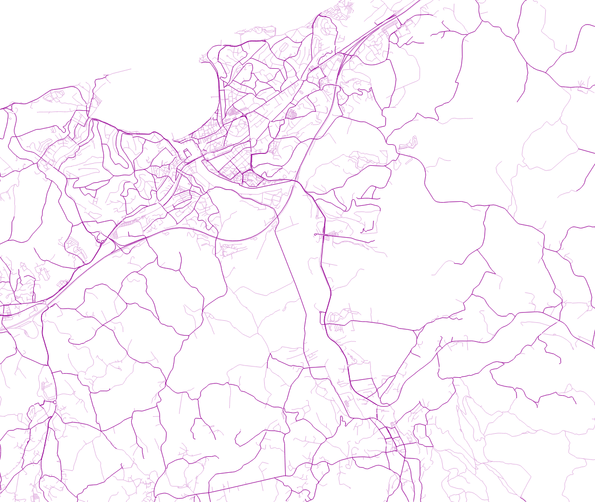

# ign-basque-benchmark
Using OSM road data for the IGN Basque road selection benchmark

## Overview

IGN has made a benchmark dataset for road selection methods using data from the Basque region, see https://ica-abs.copernicus.org/articles/4/5/2022/ica-abs-4-5-2022.pdf.

The IGN benchmark shapefiles use probably IGN network data. The goal here is to use OpenStreetMap data instead for the same benchmark.

<i>Roads from OpenStreetMap with `highway=*` in light color and the ones that roughly match the IGN benchmark final shapefile in dark color.</i>

## Steps

1. Buffer IGN final roads in QGIS with 5 m.
1. Load OSM extract.
1. Intersect OSM with IGN buffered poylgons.
1. Save as "clipped-osm.gpkg".
1. Run `python3 select.py`.

## License

- OpenStreetMap files as ODbL https://www.openstreetmap.org/copyright
  - filtered_output.gpkg
  - osm.gpkg
  - osm-clipped.gpkg
- IGN shapefiles as CC-BY https://zenodo.org/records/5744120
- Code as MIT

